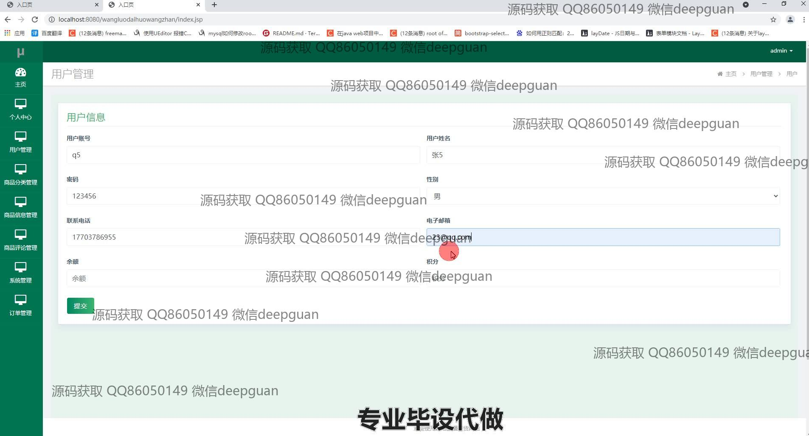

<h1 align="center">基于JAVA的网络直播带货查询系统的设计与实现</h1>

## 简介
角色包括管理员和普通用户；功能涵盖用户管理、商品分类和信息管理、订单与评论管理、系统轮播信息管理及个人中心，可实现用户注册登录、订单查询与管理、商品展示及评论查询。    --计算机毕业设计源码；毕设源码；java毕业设计源码

## 联系方式

<h3 align="center">获取完整代码与数据库文件 + 微信：deepguan QQ: 86050149 QQ群: 783742310</h3>

<h3 align="center">可帮忙远程部署 包运行成功！提供远程部署、修改代码、设计文档指导、代码讲解等服务！</h3>

## 功能介绍（完整见运行截图）
管理员：管理员可通过系统进行用户信息管理、商品分类管理、商品信息管理、商品评论管理和订单管理等操作。管理员可查看及编辑用户详细信息，管理商品的录入、编辑、上下架及评论审核，查看不同状态的订单并执行删除等操作，有效追踪和管理订单全生命周期。此外，管理员还负责轮播信息的编辑与删除，并处理已退款订单维持系统的秩序和安全。

用户：用户通过系统完成账户注册、登录和信息修改，尽享主页导航、商品信息查询、新闻资讯浏览及购物车查看等功能。用户可在个人中心更新账户信息，查看历史订单，管理地址和收藏，向管理员发起售后请求。购物中，用户可方便地选择商品、查看详情、加入购物车并结算订单。用户还能管理个人积分和余额，有效使用在线查询与购物功能提升购物体验。

## 运行截图

本代码来源于网络,仅供学习参考使用!

